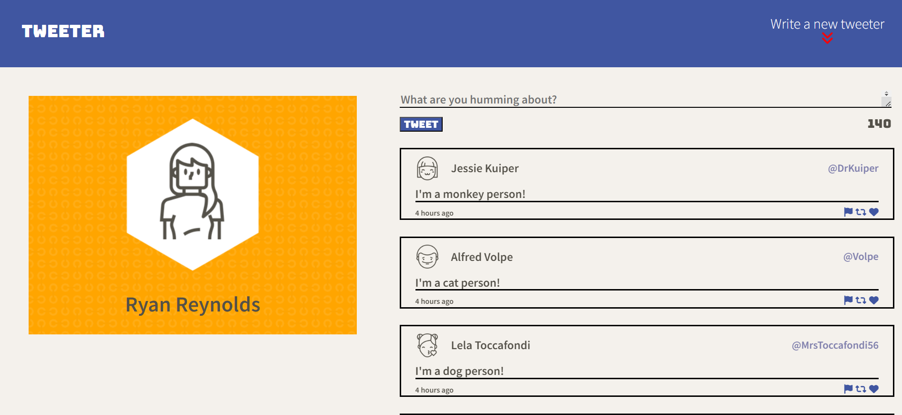
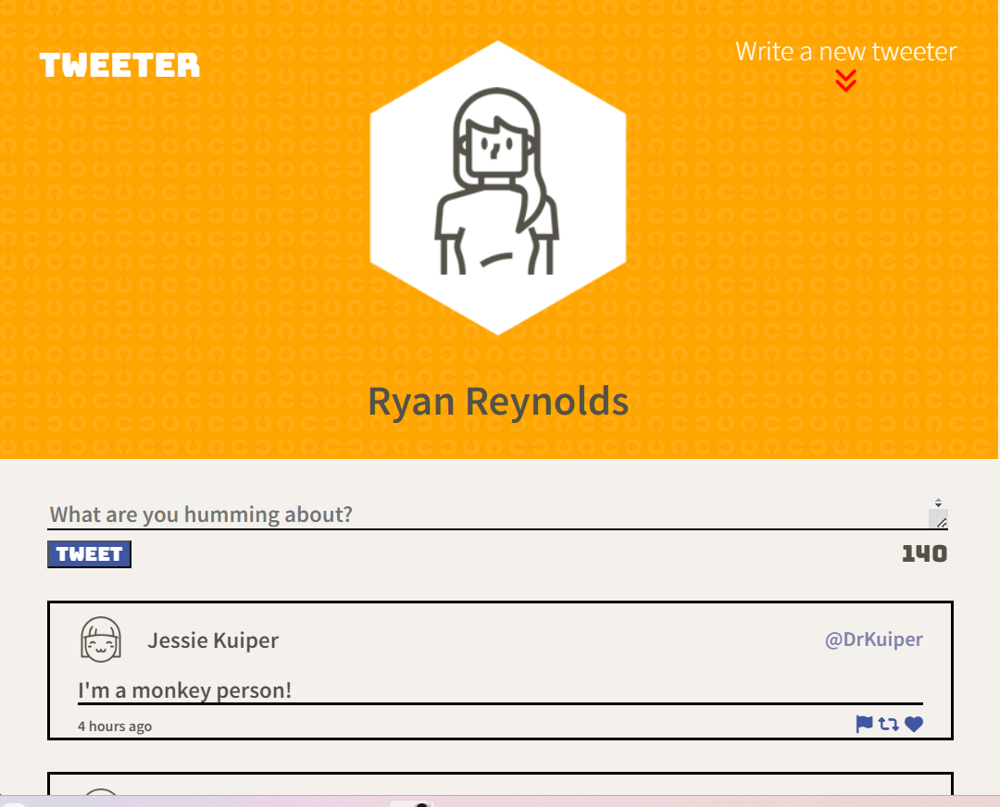

# Tweeter Project

Tweeter is a simple, single-page Twitter, started with the repository provided by LHL.
This project is to practice HTML, CSS, JS, jQuery and AJAX front-end skills, and Node, Express back-end skills as well.

## Requirements have been fulfilled

- Functional Requirements
  - A client-side Single Page App (SPA)
  - Communicates with a server via AJAX

## Display Requirements

- Navigation Bar:
  - is fixed to the top
  - has padding on both sides
  - contains Compose button

- Compose Tweet box:
  - is displayed above the list of tweets
  - contains a form for submitting tweets, which itself contains:
    - a textarea for new tweet content
    - a left-aligned button for submitting new tweets
  - contains a Character Counter, right-aligned, which by default shows 140

- List of Tweets:
  - displays tweets in reverse-chronological order (that is, by creation time descending)

- Individual Tweets have a:

  - header, which contains the user's:
    - avatar, on the left
    - name, on the left and after the avatar
    - handle, on the right
  - body, which contains the tweet text
  - footer, which displays:
    - how long ago the tweet was created, on the left
    - "Flag", "Re-tweet" and "Like" action icons on the right

## Behaviour
## Individual Tweets
- When the user hovers over a tweet, that tweet should display a box shadow.
## Action Icons
- When the user hovers over an icon ("Flag", "Re-tweet" and "Like") the icon should change colour.
## Character Counter
- When a user types into the Compose Tweet textarea, the Character Counter is updated to show how many characters a user may still type (subtracting the number of characters they've typed from the maximum allowable character count of 140)

- The Character Counter turns red (or similar) when more than 140 characters have been typed into the Compose Tweet textarea, and it shows how many characters over the 140 limit have been typed (using a negative number)

## Compose Tweet
- When a user submits an invalid tweet (the tweet textarea is empty or contains more than 140 characters), an appropriate error message is displayed

- When a user submits a valid tweet, the list of tweets is refreshed (displaying the new tweet), the Compose Tweet textarea is cleared, and the Character Counter is reset (to 140)

## Navigation Bar
- When a user clicks the Compose button in the Navigation Bar:
  - if the Compose Tweet box is currently hidden, then it is shown, and the textarea inside it is auto-focused
  - if the Compose Tweet box is currently showing, then it is hidden
  - in either case, transitions between 'shown' and 'hidden' states should be animated

## Second Toggle Button
- When a user scrolls a second button appears in the lower right hand corner:
  - if the user clicks this button they are brought back up to the top of the page

## Final Product

Different breakpoints are considered.

- Desktop mode is considered as 1024px and above.

- Tablets are commonly between 768px to 1024px.

## Getting Started

- Install all dependencies (using the `npm install` command).
- Run the development web server using the `npm start local` command.

## Dependencies

- Express
- Node 5.10.x or above
- timeago 
- body-parser
- chance
- md5
